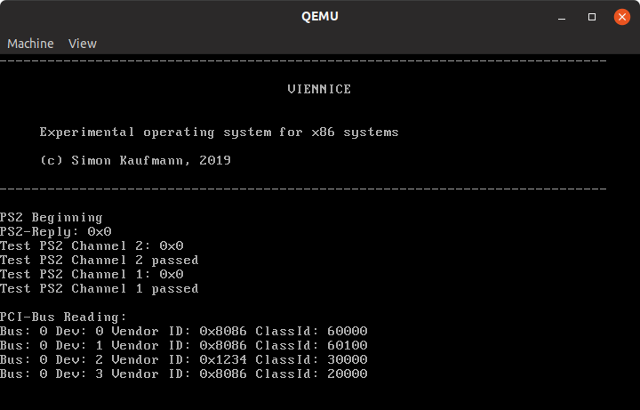
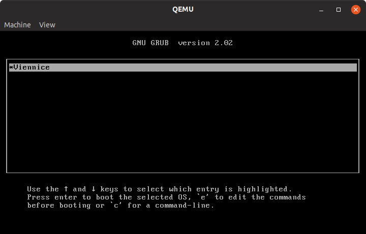

# Viennice - Small x86-OS project

## Quickstart

Install packages (tested on Ubuntu 19.04):
kpartx
qemu-kvm

Run from root directory of repository:  
`./scripts/create_grub_image`  
`cp ./scripts/os.img ./run/image/`  
`cd code`  
`sudo make run`  

This will create an os.img file containing a grub bootloader. The `make run`
command will compile the OS code and copy the kernel image into the boot image
to be loaded by Grub. The Makefile will also start the qemu emulator and run
the operating system.

To create a bootable USB stick or CD refer to `doc/manual`

Detailed instructions for this process cna be found in section
"Grub installation to Image file" in doc/manual

## Create bootable USB flash drive with the OS

Look at doc/manual for instructions to create a bootable GRUB flash drive which can boot the OS.

## What can the OS do?

Interrupts, keyboard driver and text mode graphic driver are implemented

## Pictures

